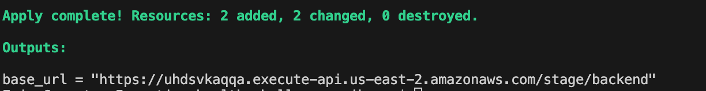
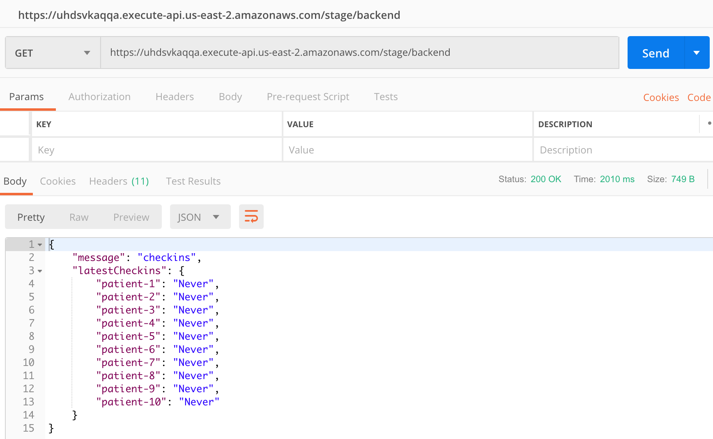
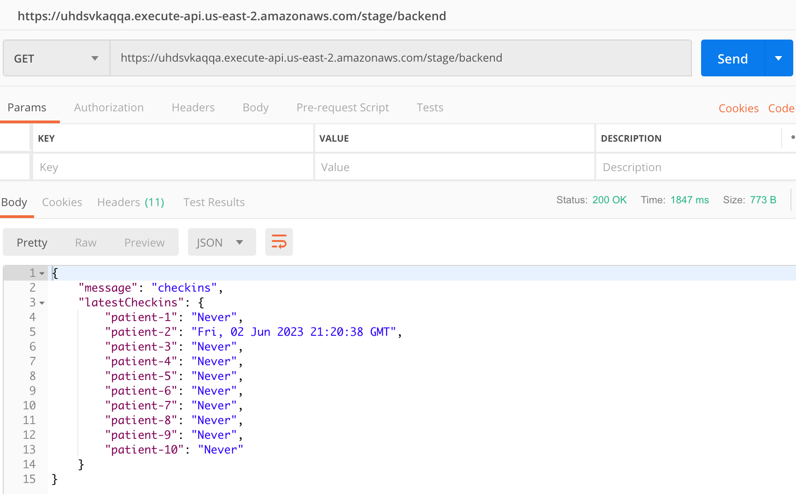
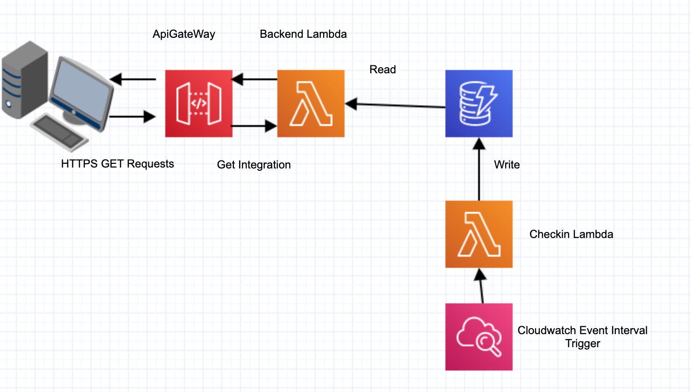
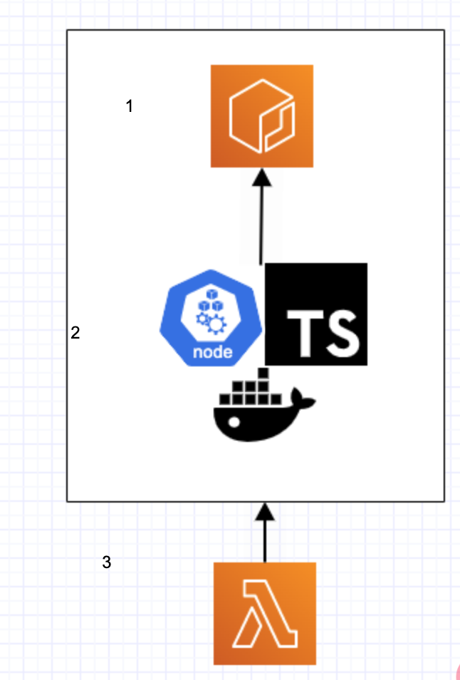

# Inception Health Technical Challenge
This project contains a public facing API for viewing the "checkins" of patients. Checkins are automatically added to the Checkin database to simulate patient checkins.

## Deploying
Run `./deploy.sh` from the root of the repository to stand up the infrastructure and begin triggering checkins. Make sure you have the appropriate credentials configured in your `~/.aws/credentials` under the profile "inception-health" as well as the AWS cli and terraformed installed to run the deploy script without issue.

Run `./destroy.sh` to tear down all the infrastructure created.

## Validating and interacting with the API
After running the deploy command, the last line of output will be the url that GETs from the Checkin table. 

### Terraform output

### Postman client - No checkins yet

Hitting this url after a few minutes, more and more patients will have checkins recorded. 

### Postman client - Some checkins

## Architecture
For communicating with the DyanmoDB Checkins table, two lambda functions were used: `backend` and `checkin`. For exposing the backend lambda's retrieval of the Checkin information, an API Gateway is used to integrate with the `backend` lambda. For triggering the checkins to be added to the database, a cloudwatch rule was created triggering the `checkin` lambda every two minutes. For this archtecture, lambdas were already provided for interacting with DynamoDB. API Gateway was chosen as a piece of infrastructure because it provides a REST interface over HTTPS as required by the instructions and it integrate with lambdas. AppSync is another possible API infrastructure choice that offers more capabilities than API Gateway, but for a simple GET request connected to a lambda, API Gateway provides all the necessary functionality. A cloudwatch event rule was chosen as the mechnaism for triggering the checkin lambda on a time interval, because it is very simple and quick to implement, and it fullfils the needs of the assignment. Other possible lambda triggering services include Kinesis, SNS, and SQS, but for triggering the lambda just on a time interval and nothing else, a Cloudwatch rule was the appropriate choice.

### Lambda image dependency
There is an interesting dependency for building a lambda using a docker image and Amazon's Elastic Container Repository for storing the function code. Before the lambda infrastructure can be created, both the Elastic Container Repository and the image containing the function code must exist. We cannot simply specify a `depends on` relationship with the lambda and ECR in our terraform code. This is because the Image also needs to be uploaded to ECR before the lambda infrastructure is create, which will not be the case if we bundle the ECR and Lambda terraform code together. Because of this, to deploy all the necessary code together in one script, a `dependencies` infrastructure folder is created containing the ECR terraform code. Once we know the ECR is deployed we build our function image and push it to ECR. Then we can proceed with deploying the lambda infrastructure as well as the rest of the infrastructure necessary for the project. This is how the `./deploy.sh` script works to deploy all infrastructure and function code in a single script.

